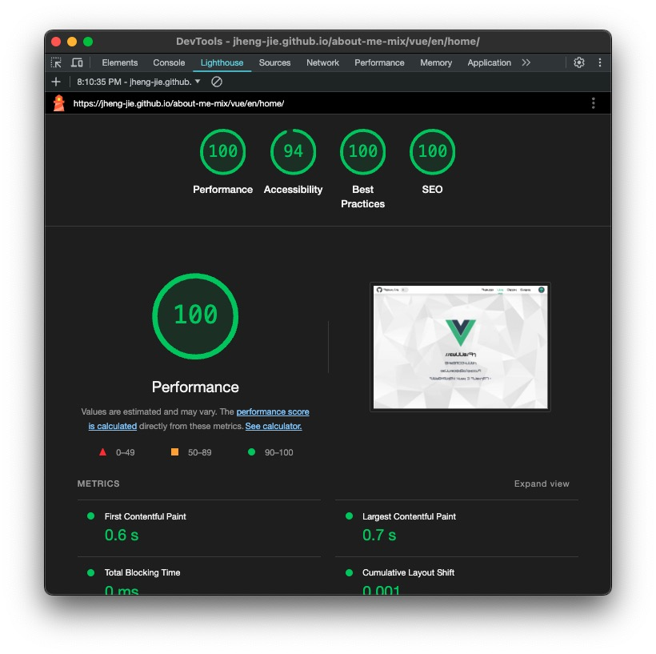
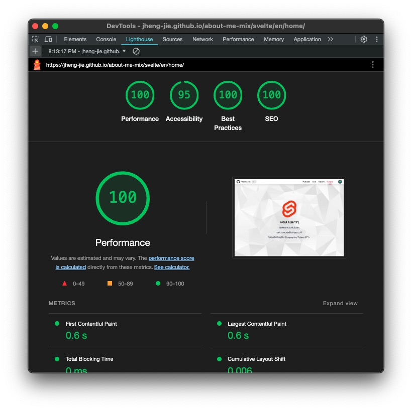
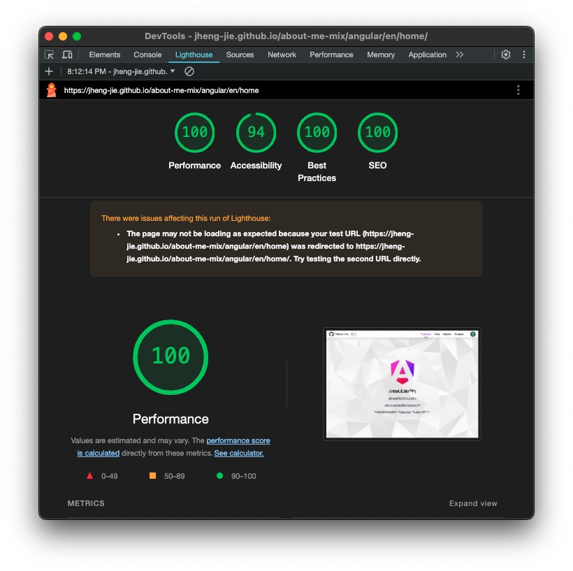

# About Me Mix

多框架 `SSG（Static Site Generation）` 專案測試

該專案使用 `Yarn Workspace` 用於管理依賴，共用部分靜態資源或程式碼

主要用於技術研究、面試展示，並非實際應用。

## 展示

> [GitHub Page](https://jheng-jie.github.io/about-me-mix/react/zh/home/)

## 快速比較

|               | Vue                      | React                                | Svelte                         | Angular                          |
| ------------- |--------------------------| ------------------------------------ | ------------------------------ | -------------------------------- |
|               |  |          |  |  |
| Server        | Nuxt 3                   | Next 14                              | SvelteKit 2                    | Angular 17                       |
| Store         | Pinia                    | Zustand                              | svelte/store                   | Signal                           |
| i18n          | @nuxtjs/i18n             | i18next, next-i18next, react-i18next | sveltekit-i18n                 | @angular/localize                |
| CSS           | sass                     | sass                                 | sass                           | sass                             |
| Atomic        | @unocss/postcss          | @unocss/postcss                      | @unocss/postcss                | UnoCSS CLI                       |
| Difficulty    | Low                      | Medium                               | Low                            | High                             |
| Learning      | Easy                     | Medium                               | Easy                           | Hard                             |
| Compatibility | Low                      | High                                 | Low                            | Low                              |
| Build         | Vite                     | Webpack                              | Vite                           | ESBuild                          |
| Bundle Size   | 182 kB / 971 kB          | 218 kB / 1.2 MB                      | 125 kB / 910 kB                | 201 kB / 993 kB                  |
  

## 框架

- `node 18.18+`

- `yarn 1.2+`

> [Nuxt v3 + Vue3](./projects/nuxt3/README.md)

> [Next v14 + Page Router](./projects/next14/README.md)

> [SvelteKit v2 + Svelte v4](./projects/svelte-kit2/README.md)

> [Angular v17](./projects/angular17/README.md)

## Develop

```sh
# mac only
yarn dev
# or
yarn workspace @about-me-mix/nuxt3 dev
yarn workspace @about-me-mix/svelte-kit2 dev
yarn workspace @about-me-mix/next14 dev
yarn workspace @about-me-mix/angular17 dev
```

## Build

```sh
yarn build
```

## Start Service

- `任意 Port`

```sh
# 3000 port example
http-server . -p 3000
# or
anywhere -p 3000
```

- `http://localhost:3000/about-me-mix`

## 檔案結構

```bash
about-me-mix
│
├── docs              # GitHub Page
│
├── projects
│   ├── communal      # 共用的資源或程式
│   ├── next14        # Next 14
│   ├── svelte-kit2   # Svelte Kit 4
│   ├── nuxt3         # Nuxt 3
│   └── angular17     # Angular 17
│
└── README.md         # 當前位置
```
